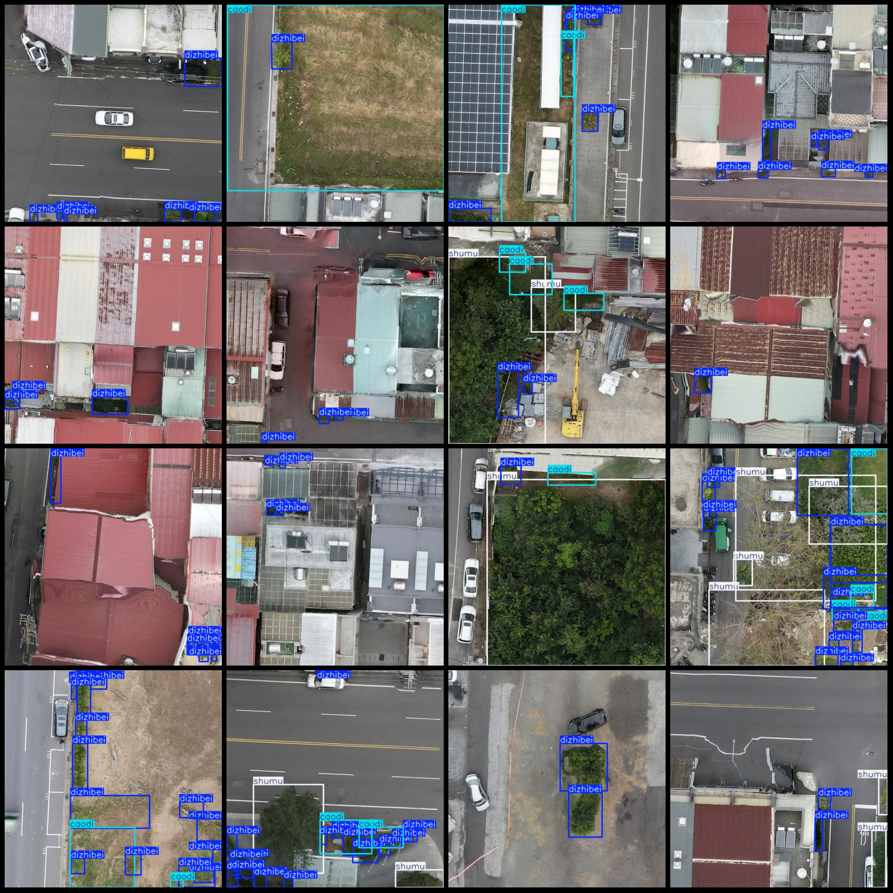
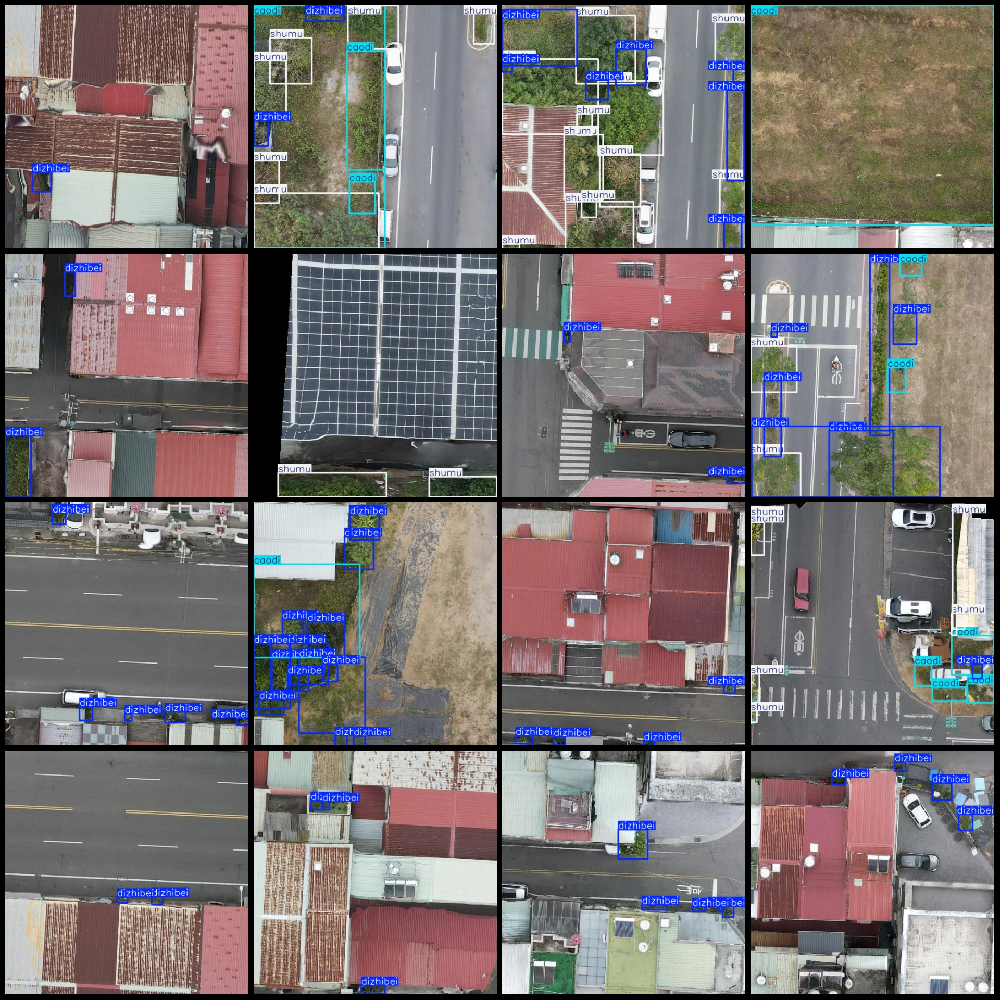

# UAV Perspective Smart City Greenery Inspection Tree and Grass Low Vegetation Detection Dataset (VOC+YOLO)

**Dataset Format:** Pascal VOC format + YOLO format (without the split path in the txt file, only containing jpg images along with corresponding VOC format xml files and YOLO format txt files)

**Number of Images (jpg Files):** 208

**Number of Annotations (xml Files):** 208

**Number of Annotations (txt Files):** 208

**Number of Annotation Categories:** 3

**Annotation Category Names:** ["caodi", "dizhibei", "shumu"]

**Each Category Annotation Boxes Number:**

- caodi (Grass) boxes number = 151, occupying images number = 75
- dizhibei (Low vegetation) boxes number = 812, occupying images number = 181
- shumu (Trees) boxes number = 292, occupying images number = 88

**Total Boxes:** 1255

**Image Resolution:** 512x512

**Usage of Annotation Tool:** labelImg

**Annotation Rules:** Draw a box around the category

**Important Notice:** The dataset does not have been divided into training, validation, or test sets. You need to divide it yourself.

**Special Declaration:** This dataset does not guarantee any accuracy for models trained on this data set or any associated weight files.

**UAV: DJI MAVIC 3**

**Collection Height:** 20-30m

**Collection Angle:** 90°

**Image Preview:**

## Images

Here is a pay link on Stripe ( https://buy.stripe.com/3cs8yP7sY87d0vu9AB ). Please contact me lonlonago@foxmail.com after funding $89, and I will send you a complete data files , thank you!

